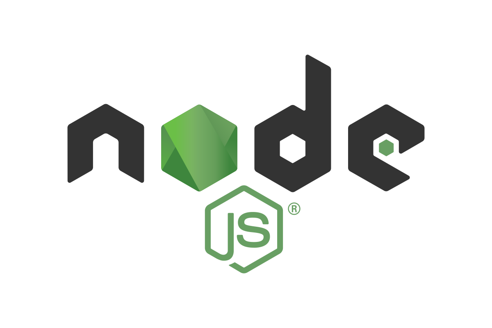

## About Me

Passionate Full Stack Developer with 8 years of experience. Fluent in mobile and web development technologies, as well
as integrating hardware for IoT solutions.

```python
from developer import FullStackIoTDeveloper

class SoftwareEngineer(FullStackIoTDeveloper):
    def __init__(self):
        self.languages = ["Kotlin", "Swift", "Dart", "C++", "TypeScript", "Python"]
        self.frameworks = ["Flutter", "Angular"]
        self.tools = ["Node.js", "Docker", "Git"]
        self.currently_learning = "Rust & Advanced IOT Development" 
        self.excited_for = "Emerging IoT Solutions"

    def contact_info(self):
        return "YOUR_EMAIL@gmail.com"
```

### Tools, Languages, and Other Things I Like to Work With

<table>
  <tr>
    <td align="center" width="96">
      
      <br>Kotlin
    </td>
    <td align="center" width="96">
      
      <br>Swift
    </td>
    <td align="center" width="100">
      
      <br>Dart
    </td>
    <td align="center" width="100">
      
      <br>C++
    </td>
    <td align="center" width="100">
      
      <br>NodeJs
    </td>
<td align="center" width="100">
      
      <br>Python
    </td>
    <!-- Other languages and tools -->
  </tr>
  <!-- Add more rows as needed -->
</table>
<!-- Include this if you have a section for coding activity stats -->

### Coding Activity
#### Feel free to get in touch to discuss technology, projects, or opportunities!